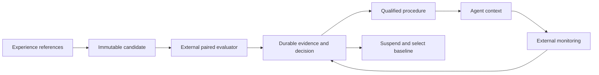

# Evidence-driven procedural memory

`qilbee_memory::learning::LearningMemory` provides a durable local learning
ledger. Agents or applications propose procedures; a trusted evaluator supplies
paired outcomes; the database qualifies, selects and suspends procedures. It
does not train model weights, generate proposals, execute instructions or run
evaluations. The HTTP server and SDKs do not expose this module yet.



## Execute the offline demonstration

```sh
cargo run -p qilbee-memory --example learning_cycle --locked
```

The example compares two real integer-parsing functions on 128 whitespace
inputs. It promotes a procedure, reopens the database, then injects reported
latency violations to demonstrate automatic suspension. It uses a temporary
directory and no model, API key or network. This is an executable API example,
not evidence of general agent improvement or benchmark leadership.

## Integration contract

1. Open a **separate database directory** with `LearningMemory::open(path)`.
2. Construct `LearningScope { tenant, agent, environment }`. The environment
   should fingerprint the model, tools, prompt and runtime versions.
3. Call `propose` with immutable instructions, source references, an exact
   baseline revision and a fixed policy. Repeating identical input is safe.
4. Run the candidate and the specified baseline on the same held-out case and
   submit `PairedEvaluation` using `record_evaluation`. Utility scores must be
   finite and in `[0, 1]`. Record cost in the policy's defined integer units.
5. Call `select(scope, task, baseline_revision, evaluation_contract, max_instruction_bytes)` to get
   an active procedure. `None` means the application should use its baseline.
   The budget counts UTF-8 bytes of instructions, **not tokenizer tokens**.
6. Submit new, paired monitoring cases. After the configured consecutive
   failure limit, selection excludes the procedure automatically. The host
   must consult selection again; already running agents are not interrupted.

`get` exposes the full proposal, aggregates and decision history; `evaluation`
retrieves an immutable receipt by case ID. Selection deterministically chooses
the highest qualification lower bound among active procedures with the same
task, baseline and evaluation contract,
breaking ties by ID. It currently scans all procedures in the scope.

The API is synchronous and performs disk I/O. Use `tokio::task::spawn_blocking`
when integrating with an asynchronous server. Clones share the same database
and writer mutex. RocksDB prevents another independent process opening the
same directory. This is not a distributed coordination protocol.

## Promotion and suspension

A candidate remains in `Candidate` until exactly `qualification_trials`
distinct cases have been recorded. Let `d_i = candidate_i - baseline_i`, so
`d_i ∈ [-1, 1]`. At that single fixed evaluation point:

```text
lower_bound = mean(d) - sqrt(2 * ln(1 / confidence_delta) / n)
```

Activation requires the bound to reach `min_improvement`, mean candidate
utility to reach `min_candidate_utility`, and every qualification trial to
satisfy cost and latency limits. Otherwise the revision becomes `Rejected`.
Bounds are stored with a lower clamp of `-1`, the difference's minimum value.
The implementation uses a standard one-sided Hoeffding inequality, not a new
statistical method; see the
[original paper](https://doi.org/10.1080/01621459.1963.10500830).

The bound assumes independent, representative held-out samples and a candidate
fixed before observing them. A fixed budget prevents repeated early-acceptance
tests within a revision. It does **not** correct selection bias across many
proposals, correlated samples, adaptive case selection, shared evaluation
data, evaluator errors or false evidence. `confidence_delta` is a per-proposal
error budget under those assumptions, not a probability that the procedure is
true or a global false-promotion guarantee. Production experiments need a
fresh holdout or a justified multiple-testing protocol and preregistered cases.

Monitoring uses a deliberately separate operational rule: reset the failure
streak only if the candidate meets the utility floor, is no worse than the
paired baseline, and meets both resource limits. At the failure limit, set
`Suspended`. This is a circuit breaker, not a statistical drift detector or a
guarantee against all regressions. Delivery order defines the streak; evaluators
must order monitoring cases. Historical successes cannot hide a recent streak.

## Integrity and trust boundary

- Proposal, baseline and evaluation policy cannot be changed under the same ID.
- Evaluation evidence, aggregate updates and decisions commit in one RocksDB
  write batch, with WAL synchronization before acknowledgement.
- A repeated identical case returns its original receipt, even after later
  state transitions. Different evidence under that ID is rejected. Case IDs
  cannot be reused across qualification and monitoring phases. A case-specific
  evidence reference cannot be counted again under a different case ID.
- Tenant, agent and environment form length-prefixed keys. Cross-scope reads
  do not find records, including IDs containing separators or Unicode.
- Evaluator ID and contract must match the proposal. Direct reuse of a proposal
  source reference as holdout evidence is rejected.

Scope and evaluator strings are **not authentication**. The host must derive
scope from an authenticated principal, protect evaluator credentials, verify
trace references, prevent case leakage and keep the proposing agent away from
the evaluation write capability and policy configuration. Different strings
can name the same underlying evidence; this API cannot detect that. A signed
source proves origin, not truth. Provenance references are not yet resolved
against the episode store or transitively revoked.

Learning records use a versioned schema in a dedicated RocksDB database;
unknown schemas and nonempty unrelated databases are rejected. There is no
data migration, compaction policy, export protocol or deletion API for this
ledger yet. Do not store private trace contents in reference IDs. Persistent
retention and privacy controls are required before sensitive production use.

## Validation

Tests exercise the fixed qualification boundary, numerical bounds, absolute
quality gates, budget violations, immutable proposals, stable duplicate
receipts, concurrent feedback, restart, namespace isolation, contract mismatch,
invalid floats, held-out reference overlap, phase checks, deterministic
selection, monitoring recovery/suspension and schema compatibility.

```sh
cargo test --workspace --all-targets --locked
cargo run -p qilbee-memory --example learning_cycle --locked
```

Tests use temporary storage and deterministic scores. Crash injection,
statistical calibration on real agents and external benchmarks remain work
items in the [evolution plan](../research/agent-memory-evolution.md).
