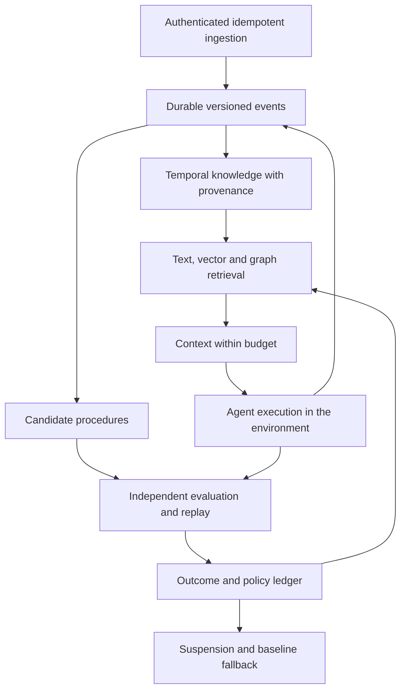

# qilbeeDB: technical assessment and evolution program

Assessment and source retrieval date: **September 20, 2026**.
Scope: Rust code, HTTP execution paths, persistence, retrieval and selected
research. This is neither an exhaustive audit nor a systematic review of the
entire literature. Third-party experimental results were not reproduced here.

## Product decision

Focus on **verifiable memory and continual learning for production agents**.
The database should preserve experience, represent knowledge and procedures,
assemble useful context and record evidence of improvement. The unit of success
is a correctly completed task within budget, while retaining earlier abilities.

Storing more text or finding vector neighbors does not demonstrate learning.
The database can support behavioral adaptation through external memory;
updating model weights requires a separate training system. Operational autonomy
can increase through automated evaluation without assuming that any objective
or evaluator is perfect. There is no evidence that this project is the best
database for agents, or that the hypotheses below are previously undiscovered.

## Findings confirmed in code

| Priority | Evidence | Consequence | Status |
|---|---|---|---|
| P0 | Baseline HTTP routes use a volatile episode map | HTTP memories disappear on restart | Versioned scoped HTTP commands, atomic receipts and process-kill recovery implemented |
| P0 | Baseline router: fixed development JWT secret and administrator | Startup is unsuitable for production | Replaced by explicit durable bootstrap in the default platform router; explicit legacy mode retains limitations |
| P0 | `/graphs` routes lack `require_auth`; `/memory` authenticates without binding agents to owners | Missing resource/tenant authorization in the inspected paths | Legacy routes excluded by default; platform identity and memory enforce authenticated tenant/subject/resource grants |
| P0 | Baseline `transaction.rs::commit` applies operations sequentially | Intermediate failure can leave a partial commit | Atomic entity/index batch and optimistic point-read conflict validation implemented; historical snapshots remain open |
| P0 | `storage.rs`: global UUID index without owner verification on deletion | Another agent could break an episode's lookup | Fixed in the persistent backend |
| P0 | Episode keys include event time, but updates did not remove the previous key | Duplicate records and inconsistent reads | Fixed with a write batch and mutual exclusion |
| P0 | Bincode over `serde_json::Value` | Stored structured payloads could not be read back | New versioned format; legacy records without JSON remain readable |
| P1 | `consolidation.rs`: LLM extraction and incomplete `BuildGraph` | Synthesis can become a fact without verification; provenance graph is missing | Open |
| P1 | `agent.rs`: volatile vector index; rebuilding regenerates embeddings | Restart behavior, cost and model changes need an explicit contract | Open |
| P1 | Baseline hybrid retrieval uses unordered ties and unranked substring matches | Retrieval can vary without a change in evidence | BM25 and deterministic rank fusion implemented; see the 0.6.0 SciFact report for external retrieval evidence |
| P1 | Baseline manager writes can evict data before rejecting foreign episodes; reads return invalidated episodes | Scope errors can remove valid memories and invalidated content remains served | Manager validation, update capacity and ordinary reads corrected |
| P1 | `PersistentAgentMemory::store_episode` does not use `auto_embed` | Configuration suggests behavior the method does not provide | Open |
| P1 | `types.rs::Relevance::decay` reapplies elapsed time since access to an already decayed score | Maintenance frequency changes forgetting behavior | Open |
| P1 | No outcome evidence in the consolidation loop | Repetition cannot be distinguished from actual improvement | Procedural ledger and authenticated HTTP implemented; external evidence verification remains open |
| P2 | `parser.rs::parse` is a placeholder; `simple_parser` exists; planner covers a subset | Full OpenCypher claims do not match the implementation | Open |
| P2 | Bolt handler and listener startup contain placeholders | Neo4j compatibility is not delivered | Open |

Inspected baseline (`4341ca4`):
[HTTP server](https://github.com/aicubetechnology/qilbeeDB/blob/4341ca420d34ca141fe1714f27fa9e26162d1e88/crates/qilbee-server/src/http_server.rs),
[transactions](https://github.com/aicubetechnology/qilbeeDB/blob/4341ca420d34ca141fe1714f27fa9e26162d1e88/crates/qilbee-storage/src/transaction.rs),
[memory manager](https://github.com/aicubetechnology/qilbeeDB/blob/4341ca420d34ca141fe1714f27fa9e26162d1e88/crates/qilbee-memory/src/agent.rs),
[consolidation](https://github.com/aicubetechnology/qilbeeDB/blob/4341ca420d34ca141fe1714f27fa9e26162d1e88/crates/qilbee-memory/src/consolidation.rs),
[memory types](https://github.com/aicubetechnology/qilbeeDB/blob/4341ca420d34ca141fe1714f27fa9e26162d1e88/crates/qilbee-memory/src/types.rs),
[parser](https://github.com/aicubetechnology/qilbeeDB/blob/4341ca420d34ca141fe1714f27fa9e26162d1e88/crates/qilbee-query/src/parser.rs),
[Bolt](https://github.com/aicubetechnology/qilbeeDB/blob/4341ca420d34ca141fe1714f27fa9e26162d1e88/crates/qilbee-protocol/src/bolt.rs).

## Research and engineering implications

The implications below are proposed qilbeeDB design decisions, not claims that
the cited work validates this implementation.

| Primary source | Relevant contribution | Proposed application |
|---|---|---|
| [DeepMind — AlphaEvolve](https://deepmind.google/blog/alphaevolve-a-gemini-powered-coding-agent-for-designing-advanced-algorithms/) | Combines model proposals, automated evaluators and evolutionary selection | Store candidates, evidence and decisions; separate generation from evaluation |
| [DeepMind — A Definition of Continual Reinforcement Learning](https://deepmind.google/research/publications/a-definition-of-continual-reinforcement-learning/) | Formalizes continual adaptation as an ongoing problem | Measure performance over time, including lost capabilities |
| [Google Research — Titans and MIRAS](https://research.google/blog/titans-miras-helping-ai-have-long-term-memory/) | Neural memory adapts during inference, with explicit retention objectives | Investigate novelty/error-based prioritization; distinguish vector indexes from trainable neural memory |
| [Google Research — Nested Learning](https://research.google/blog/introducing-nested-learning-a-new-ml-paradigm-for-continual-learning/) | Proposes optimization levels with different update frequencies | Explore separate update rates for episodes, abstractions and procedures; neural reproduction requires separate infrastructure |
| [Anthropic — Context engineering](https://www.anthropic.com/engineering/effective-context-engineering-for-ai-agents) | Treats context as a finite resource; discusses compaction and structured notes | Retrieve sufficient evidence within a context budget |
| [Anthropic — Evals for agents](https://www.anthropic.com/engineering/demystifying-evals-for-ai-agents) | Distinguishes tasks, trials, graders, trajectories and observed outcomes | Version evaluation contracts and measure actual effects, including regressions |
| [A-MEM](https://arxiv.org/abs/2502.12110) | Dynamically organizes notes and links memories | Represent relationships and revise abstractions while preserving sources |
| [Memory-R1](https://arxiv.org/abs/2508.19828) | Learns memory operations using outcome-driven rewards | Collect telemetry for future policies; the current ledger does not implement PPO/GRPO |
| [AgeMem](https://arxiv.org/abs/2601.01885) | Integrates short- and long-term memory management into the agent policy | Expose measurable memory operations before training a management policy |
| [Zep/Graphiti](https://arxiv.org/abs/2501.13956) | Uses temporal graphs to integrate experience and changing knowledge | External baseline and reference for mutable knowledge; bitemporality alone is not sufficient differentiation |
| [Mem0](https://arxiv.org/abs/2504.19413) | Extracts, consolidates and retrieves information, with cost evaluation | Compare under the same model, budget and protocol |
| [AgentPoison](https://arxiv.org/abs/2407.12784) | Demonstrates attacks through poisoned memories and knowledge bases | Test hostile evidence and invalidation propagation; metadata alone does not establish truth |

Titans/MIRAS and Nested Learning are Google Research work; sources identified
as DeepMind above are from Google DeepMind. Engineering reports and preprints
have different evidentiary status from independently reproduced results.

## Target architecture

Explicitly distinguish observations, claims, hypotheses, procedures and
outcomes. Every derivation should retain source references, extractor version,
valid time in the world and transaction time in the database. A correction
should end a claim's validity while preserving history rather than silently
replacing a fact.

Memory policy should use verifiable outcomes and resource budgets to decide
what to acquire, retrieve, compact, invalidate and forget. Preserve experiences
that contradict the prevailing procedure to avoid confirmation loops. The
current ledger is an initial component of this architecture, not its entirety.

## Specific research hypotheses

| Hypothesis to test | Controlled experiment | Retention criterion |
|---|---|---|
| Counterfactual utility outperforms access frequency | Replay cases with and without groups of memories under equal budgets | Better held-out task outcome per token without worse retention |
| Environment-specific procedures prevent negative transfer | Change an API/tool and compare global retrieval with version-conditioned retrieval | Fewer invalid actions and faster adaptation |
| Source invalidation must propagate to derived memories | Correct/delete an episode and follow dependencies to summaries and procedures | No revoked derivative remains served after acknowledgement |
| Evidence debt identifies fragile abstractions | Track synthesis depth, source diversity and subsequent failures | Calibrated predictive gain beyond simple source counts |
| Forgetting should preserve counterexamples | Compare TTL, decay and outcome-conditioned retention | Less loss of earlier abilities under equal storage budgets |
| Optimization can exploit its own evaluator | Introduce grader attacks and hidden tests isolated from the generator | Improvements survive an independent evaluator and unseen cases |

These are hypotheses for experimentation, not demonstrated discoveries or
novelty claims. Surprise, consensus and model confidence can provide signals;
they are never automatic certificates of truth.

## Evaluation protocol for state-of-the-art comparisons

1. **Freeze the experiment:** commit, hardware, dataset revision and license,
   model/embedding, prompts, tokenizer, seeds, grader and cost limits. Separate
   development, selection and final holdout sets. Do not send private data to
   external evaluators by default.
2. **Compare equal conditions:** no memory, full context when feasible, text
   search, vector RAG, hybrid retrieval and pinned external systems. Include
   ingestion, consolidation and reconstruction costs, not just query cost.
3. **Measure distinct abilities:**
   [LongMemEval](https://arxiv.org/abs/2410.10813) for updating knowledge,
   temporal reasoning and abstention;
   [LongMemEval-V2](https://arxiv.org/abs/2605.12493) for environment experience
   and workflows; [MemoryAgentBench](https://arxiv.org/abs/2507.05257) for
   retrieval, test-time learning, long-range understanding and forgetting;
   [LoCoMo](https://arxiv.org/abs/2402.17753) for complementary conversational
   evaluation. Pin each dataset revision and review ambiguous examples.
4. **Measure actual operation:** task success, recall of all required evidence,
   temporal errors, calibrated abstention, learning curves, transfer, retention
   of old tasks, p50/p95/p99 latency, tokens, total cost and stored bytes.
   High retrieval recall does not substitute for answer quality.
5. **Exercise database guarantees:** abrupt restart, disk failure, concurrency,
   duplicate delivery, isolation, deletion including derivatives, index
   reconstruction and hostile data.
6. **Publish artifacts:** commands, per-case results, uncertainty intervals,
   failures, limitations and ablations. Obtain external reproduction before
   claiming leadership. None of these external benchmarks ran in this stage.

Initial proposed targets, subject to a measured baseline: zero isolation
violations in the test suite; zero loss of acknowledged writes in the durable
profile under the declared fault model; positive held-out improvement at equal
cost; and regression on old tasks within a preregistered limit. Define latency
and scale targets per hardware and workload rather than inventing universal
numbers.

## Deliverables and implementation sequence

| Milestone | Deliverable and exit criterion | Status |
|---|---|---|
| F1 | Episode integrity, legacy reads, JSON, concurrent mutations and reopen tests | Implemented and tested in the persistent backend |
| F2 | Immutable proposals, idempotent paired outcomes, promotion, monitoring and suspension with atomic persistence | Implemented in the Rust library; offline demonstration |
| F3 | Secure bootstrap, resource ownership, persistent HTTP memory and separate evaluator authorization | Identity, scoped memory and procedural evaluator/policy HTTP implemented; external evidence verification and policy retirement remain pending |
| F4 | Atomic transactions with consistent indexes, documented conflicts and fault-injection recovery tests | Atomic entity/index writes and point-read conflict validation implemented; historical snapshots, canonical map-property indexes and fault injection remain open |
| F5 | Resolvable provenance, bitemporal revisions and transitive invalidation/deletion | Planned |
| F6 | Persisted/versioned embeddings, rebuildable index, ranked text search, deterministic hybrid retrieval and tokenizer budgets | BM25 and deterministic rank fusion implemented; remaining work planned |
| F7 | Benchmark adapters, published baselines and learning-loop ablations | Planned |
| F8 | Learned acquisition/forgetting policies and counterfactual experiments | Research contingent on earlier results |
| F9 | Replication, verified backup/restore, optional tenant policies, observability and scale | Planned after local guarantees |

Publish each improvement as a separate feature with acceptance criteria, tests,
compatibility notes and a remote repository change. Merge validated features in
[batches of five PRs](../contributing/feature-delivery.md). Do not advertise library
features as HTTP features before integration. Selection policies may improve
agent behavior; general failure-free autonomy and indefinite self-improvement
remain research problems.

The maintainer's [delivery acceptance contract](delivery-acceptance.md) now fixes
P0/P1/P2 priorities. QilbeeDB must operate independently of QMN while absorbing
validated capabilities through explicit platform contracts. See the initial
[QMN semantic mapping](qmn-contract-mapping.md); existing promotion mechanisms
must not be treated as equivalent without policy and evidence compatibility.

## Validation of this delivery

The first batch contains five features. Roadmap milestone identifiers above
describe the broader program, not the chronological PR order:

| Feature | Regression coverage | Clean workspace tests after the feature |
|---|---|---|
| Durable episode integrity | Eight new tests; five initial reproductions failed | 285 |
| Evidence-driven procedures | Fifteen contract tests and an offline example | 300 |
| Lexical and hybrid retrieval | Seven tests; four initial reproductions failed | 307 |
| Scoped episode lifecycle | Seven new tests and an updated invalidation contract | 314 |
| Atomic graph commits | Seven tests; four initial reproductions failed | See the feature PR for final validation |

Validation uses `cargo test --workspace --all-targets --locked`. No external
agent benchmark, paid model evaluation or power-loss simulation was run.
Workspace Clippy currently reports pre-existing `approx_constant` errors in
core property tests; it is not a passing gate. Each feature PR records its
commands and tested commit.

Pre-existing local SDK and provider changes are excluded from these commits.
Existing application databases in `data/` and test-data directories were not
migrated or rewritten by these features.

Details: [storage integrity](../agent-memory/storage-integrity.md),
[learning contract](../agent-memory/learning.md),
[retrieval](../agent-memory/lexical-retrieval.md),
[episode lifecycle](../agent-memory/episode-lifecycle.md) and
[atomic graph commits](../architecture/atomic-commits.md).

## Subsequent retrieval and memory research

The [0.6.0 SciFact report](scifact-results.md) adds external retrieval judgments;
it does not qualify agent-task improvement. The [experience-memory design](experience-memory-design.md)
reviews the supplied ReasoningBank, ZenBrain and Dream-RSI work and proposes
contracts for experience lineage, replay and shared publication.
